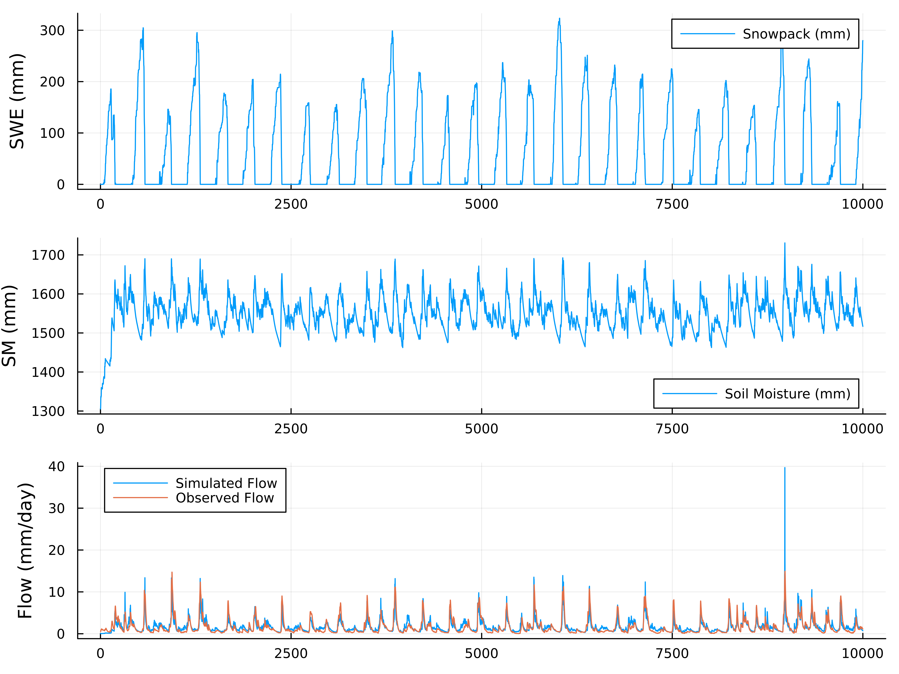

# Getting start with HydroModels.jl

This guide provides a comprehensive introduction to HydroModels.jl, a Julia package for hydrological modeling. We'll walk through the installation process, build a complete ExpHydro model, and demonstrate how to run simulations with real-world data.

## Install HydroModels.jl

HydroModels.jl can be installed directly from the Julia package manager. Open a Julia REPL and enter the following command:

```julia
] add HydroModels
```

For the latest development version, you can install directly from the GitHub repository:

```julia
] add https://github.com/chooron/HydroModels.jl
```

After installation, load the package with:

```julia
using HydroModels
using ComponentArrays  # For parameter handling
using CSV, DataFrames  # For data input/output
```

## Build a ExpHydro Model

### Introduction to ExpHydro Model

The ExpHydro model is a conceptual rainfall-runoff model that simulates watershed hydrology through a series of interconnected processes. It consists of two main components:

1. **Snowpack Bucket**: Handles snow accumulation and melt processes

```math
\begin{aligned}
& pet = 29.8 \cdot lday \cdot 24 \cdot 0.611 \cdot \frac{\exp(17.3 \cdot temp)}{temp + 237.3} \cdot \frac{1}{temp + 273.2} & \quad & (1) \\
& snowfall = H(T_{min} - temp) \cdot prcp & \quad & (2) \\
& rainfall = H(temp - T_{min}) \cdot prcp & \quad & (3) \\
& melt = H(temp - T_{max}) \cdot H(snowpack) \cdot \min(snowpack, D_f \cdot (temp - T_{max})) & \quad & (4) \\
& \frac{d(snowpack)}{dt} = snowfall - melt & \quad & (5) \\
\end{aligned}
```

2. **Soil Water Bucket**: Manages soil moisture, evapotranspiration, and runoff generation

```math
\begin{aligned}
& evap = H(soilwater) \cdot pet \cdot \min\left(1.0, \frac{soilwater}{S_{max}}\right) & \quad & (6) \\
& baseflow = H(soilwater) \cdot Q_{max} \cdot \exp\left(-f \cdot \max(0.0, S_{max} - soilwater)\right) & \quad & (7) \\
& surfaceflow = \max(0.0, soilwater - S_{max}) & \quad & (8) \\
& flow = baseflow + surfaceflow & \quad & (9) \\
& \frac{d(soilwater)}{dt} = rainfall + melt - evap - flow & \quad & (10) \\
\end{aligned}
```

where $H(x)$ represents the Heaviside step function that equals 1 when $x > 0$ and 0 otherwise; $T_{min}$, $T_{max}$, $D_f$, $S_{max}$, $Q_{max}$, and $f$ are model parameters; $temp$, $lday$, and $prcp$ are input variables; $snowpack$ and $soilwater$ are state variables; and the remaining variables are intermediate calculation variables.

The model uses temperature thresholds to partition precipitation into rainfall and snowfall, and employs exponential functions to represent soil moisture dynamics. Its relative simplicity combined with physical process representation makes it an excellent starting point for hydrological modeling.

Key parameters in the ExpHydro model include:

- `Tmin`: Minimum temperature threshold for snow/rain partitioning
- `Tmax`: Temperature threshold for snowmelt initiation
- `Df`: Degree-day factor for snowmelt calculation
- `Smax`: Maximum soil water storage capacity
- `f`: Parameter controlling baseflow recession
- `Qmax`: Maximum baseflow rate

### Build an ExpHydro Model in HydroModels.jl

HydroModels.jl provides a flexible framework for constructing hydrological models using a component-based approach. Let's build the ExpHydro model step by step.

#### 1. Define the Variables and Parameters based on ModelingToolkit.jl

First, we need to define the variables and parameters that will be used in our model. HydroModels.jl leverages ModelingToolkit.jl for symbolic representation of model components.

```julia
# Import necessary functions
using HydroModels

# Define the step function used in hydrological processes
step_func(x) = (tanh(5.0 * x) + 1.0) * 0.5

# Define variables and parameters (the macro @variables and @parameters are from ModelingToolkit.jl)
@variables temp lday prcp pet snowfall rainfall snowpack melt
@variables soilwater evap baseflow surfaceflow flow
@parameters Tmin Tmax Df Smax Qmax f
```

Here, we define:

- Input variables: `temp` (temperature), `lday` (day length), `prcp` (precipitation)
- State variables: `snowpack` (snow water equivalent), `soilwater` (soil moisture)
- Intermediate flux variables: `snowfall`, `rainfall`, `melt`, `pet` (potential evapotranspiration), etc.
- Output variables: `flow` (total streamflow)
- Model parameters: `Tmin`, `Tmax`, `Df`, `Smax`, `Qmax`, `f`

#### 2. Build the ExpHydro Model

With variables and parameters defined, we can now construct the complete ExpHydro model using HydroModels.jl's macro-based syntax:

```julia
# Define the snow component
snow_bucket = @hydrobucket :snow begin
    fluxes = begin
        @hydroflux pet ~ 29.8 * lday * 24 * 0.611 * exp((17.3 * temp) / (temp + 237.3)) / (temp + 273.2)
        @hydroflux snowfall ~ step_func(Tmin - temp) * prcp
        @hydroflux rainfall ~ step_func(temp - Tmin) * prcp
        @hydroflux melt ~ step_func(temp - Tmax) * step_func(snowpack) * min(snowpack, Df * (temp - Tmax))
    end
    dfluxes = begin
        @stateflux snowpack ~ snowfall - melt
    end
end

# Define the soil water component
soil_bucket = @hydrobucket :soil begin
    fluxes = begin
        @hydroflux evap ~ step_func(soilwater) * pet * min(1.0, soilwater / Smax)
        @hydroflux baseflow ~ step_func(soilwater) * Qmax * exp(-f * (max(0.0, Smax - soilwater)))
        @hydroflux surfaceflow ~ max(0.0, soilwater - Smax)
        @hydroflux flow ~ baseflow + surfaceflow
    end
    dfluxes = begin
        @stateflux soilwater ~ (rainfall + melt) - (evap + flow)
    end
end

# Combine components into the complete ExpHydro model
exphydro_model = @hydromodel :exphydro begin
    snow_bucket
    soil_bucket
end
```

### Step by Step Analysis of the Build Process

Let's break down the model construction process to understand each component in detail.

#### 1. First Build one Hydrological Flux

A hydrological flux represents a specific process in the water cycle. For example, the snowfall flux is defined as:

```julia
snowfall_flux = @hydroflux snowfall ~ step_func(Tmin - temp) * prcp
```

This equation partitions precipitation into snowfall based on temperature. When temperature is below `Tmin`, the step function approaches 1, and precipitation is treated as snowfall. The `~` operator establishes the mathematical relationship between variables.

Each flux has:

- Input variables (right side of `~`): Variables used to calculate the flux
- Output variable (left side of `~`): The resulting flux value
- Parameters: Model coefficients used in the calculation

#### 2. Build All Fluxes inner the Snowpack Bucket

The snowpack bucket contains multiple fluxes that work together to simulate snow processes:

```julia
fluxes = begin
    @hydroflux pet ~ 29.8 * lday * 24 * 0.611 * exp((17.3 * temp) / (temp + 237.3)) / (temp + 273.2)
    @hydroflux snowfall ~ step_func(Tmin - temp) * prcp
    @hydroflux rainfall ~ step_func(temp - Tmin) * prcp
    @hydroflux melt ~ step_func(temp - Tmax) * step_func(snowpack) * min(snowpack, Df * (temp - Tmax))
end
```

These fluxes represent:

- `pet`: Potential evapotranspiration calculated using a temperature-based formula
- `snowfall`: Precipitation that falls as snow when temperature is below `Tmin`
- `rainfall`: Precipitation that falls as rain when temperature is above `Tmin`
- `melt`: Snowmelt that occurs when temperature exceeds `Tmax`, limited by available snowpack

#### 3. Build the Snowpack Bucket Based on these Flux

A bucket in HydroModels.jl represents a storage component with state variables that change over time. The `@hydrobucket` macro creates a complete hydrological storage unit that encapsulates both water movement processes and state evolution equations.

```julia
snow_bucket = @hydrobucket :snow begin
    fluxes = begin
        @hydroflux pet ~ 29.8 * lday * 24 * 0.611 * exp((17.3 * temp) / (temp + 237.3)) / (temp + 273.2)
        @hydroflux snowfall ~ step_func(Tmin - temp) * prcp
        @hydroflux rainfall ~ step_func(temp - Tmin) * prcp
        @hydroflux melt ~ step_func(temp - Tmax) * step_func(snowpack) * min(snowpack, Df * (temp - Tmax))
    end
    dfluxes = begin
        @stateflux snowpack ~ snowfall - melt
    end
end
```

The bucket consists of two main sections:

- **fluxes**: Defines the hydrological processes that move water in and out of the bucket. Each flux is created with the `@hydroflux` macro and represents a specific hydrological process (e.g., snowfall, rainfall, melt).
- **dfluxes**: Specifies how state variables change over time using the `@stateflux` macro. In this example, the snowpack state variable changes according to the equation `snowpack ~ snowfall - melt`, meaning the change in snowpack equals snowfall minus snowmelt.

The first argument (`:snow`) provides a name for the bucket, which helps with identification and debugging. When the model runs, these equations are automatically converted into a system of differential equations that will be solved by the selected numerical solver.

#### 4. Build ExpHydro Model Based on the Snowpack Bucket and Soilwater Bucket

After creating the snow bucket, we need to define the soil water bucket that handles soil moisture dynamics, evapotranspiration, and runoff generation:

```julia
soil_bucket = @hydrobucket :soil begin
    fluxes = begin
        @hydroflux evap ~ step_func(soilwater) * pet * min(1.0, soilwater / Smax)
        @hydroflux baseflow ~ step_func(soilwater) * Qmax * exp(-f * (max(0.0, Smax - soilwater)))
        @hydroflux surfaceflow ~ max(0.0, soilwater - Smax)
        @hydroflux flow ~ baseflow + surfaceflow
    end
    dfluxes = begin
        @stateflux soilwater ~ (rainfall + melt) - (evap + flow)
    end
end
```

The soil bucket includes several important hydrological processes:

- **Evapotranspiration** (`evap`): Water loss from soil to atmosphere, dependent on potential evapotranspiration (`pet`) and available soil moisture
- **Baseflow** (`baseflow`): Subsurface flow that follows an exponential relationship with soil moisture deficit
- **Surface runoff** (`surfaceflow`): Excess water when soil moisture exceeds maximum capacity (`Smax`)
- **Total streamflow** (`flow`): Combined baseflow and surface runoff

The state equation for soil moisture (`soilwater`) accounts for all inputs (rainfall and snowmelt) and outputs (evapotranspiration and streamflow).

Finally, we combine the snow and soil components into a complete model using the `@hydromodel` macro:

```julia
exphydro_model = @hydromodel :exphydro begin
    snow_bucket
    soil_bucket
end
```

This creates a model named "exphydro" with two interconnected components. HydroModels.jl automatically handles the connections between components based on variable names. For example, the `rainfall` and `melt` outputs from the snow bucket are used as inputs to the soil bucket, and the `pet` calculation from the snow bucket is used in the evapotranspiration calculation in the soil bucket.

The `@hydromodel` macro performs several important tasks:

1. Analyzes dependencies between components to determine the correct execution order
2. Creates a computational graph that efficiently routes information between components
3. Manages state variables across the entire model
4. Prepares the model for simulation with various solver options

## Run the ExpHydro Model With Real Data

### Preparation

Before running the model, we need to prepare input data, parameters, and initial states.

#### 1. Load 01013500 forcing data from the CAMELS Dataset

The CAMELS (Catchment Attributes and Meteorology for Large-sample Studies) dataset provides hydrometeorological time series for many watersheds. We'll use data from basin 01013500 as an example:

```julia
# Load forcing data
file_path = "data/exphydro/01013500.csv"
df = DataFrame(CSV.File(file_path))

# Select a time period for simulation
ts = collect(1:10000)  # One year of daily data

# Extract required input variables
input_data = (
    lday = df[ts, "dayl(day)"],   # Day length
    temp = df[ts, "tmean(C)"],    # Mean temperature
    prcp = df[ts, "prcp(mm/day)"] # Precipitation
)

q_data = df[ts, "flow(mm)"]

# Convert to matrix format required by HydroModels.jl
# We need to make the input matrix in the sort of the input names of the model
input_matrix = reduce(hcat, input_data[HydroModels.get_input_names(exphydro_model)]) |> permutedims
```

It is worth noting that in the line `input_matrix = reduce(hcat, input_data[HydroModels.get_input_names(exphydro_model)]) |> permutedims` we need to get the input variable names of the model according to `get_input_names(exphydro_model)` so that the input matrix has the correct order.

#### 2. Prepare Parameters and Initial States

Next, we set up the model parameters and initial states:

```julia
# Define parameter values (calibrated for basin 01013500)
# Create parameter ComponentVector
params = ComponentVector(
    f = 0.0167 , # Baseflow recession parameter
    Smax = 1709.46 , # Maximum soil water storage (mm)
    Qmax = 18.47 , # Maximum baseflow rate (mm/day)
    Df = 2.674 , # Degree-day factor for snowmelt (mm/°C/day)
    Tmax = 0.17 , # Temperature threshold for snowmelt (°C)
    Tmin = -2.09 # Temperature threshold for snow/rain partitioning (°C)
)

# Set initial states
init_states = ComponentVector(
    snowpack = 0.0,       # Initial snow water equivalent (mm)
    soilwater = 1303.00   # Initial soil moisture (mm)
)

# Combine into parameter array structure
pas = ComponentVector(params = params)
```

The input parameters and initial states are stored in the type provided by [ComponentArrays.jl](https://github.com/SciML/ComponentArrays.jl). Each parameter name corresponds to a parameter value, and finally they are unified into `pas`. Params represents the hydrological model parameters, and nns represents the neural network parameters (see neuralnetwork_embeding.md)

#### 3. Prepare the Running Config

Finally, we configure the simulation settings using the new `HydroConfig` type:

```julia
# Define simulation configuration
config = HydroConfig(
    # Solver type: MutableSolver, ImmutableSolver, ODESolver, or DiscreteSolver
    solver = MutableSolver,
    # Interpolation method (wrapped in Val for type stability)
    interpolator = Val(DirectInterpolation),
    # Time indices for simulation
    timeidx = ts,
    # Device function (e.g., for GPU acceleration)
    device = identity,
    # Minimum value threshold for numerical stability
    min_value = 1e-6,
    # Parallel computation flag
    parallel = false
)
```

The configuration includes:

- `solver`: Numerical solver type
  - `MutableSolver`: Iterative solver with high memory efficiency (default)
  - `ImmutableSolver`: Functional solver, better for automatic differentiation
  - `ODESolver`: For use with DifferentialEquations.jl solvers
  - `DiscreteSolver`: For pure algebraic equations
- `interpolator`: Method for interpolating input data, wrapped in `Val` for type stability
  - `DirectInterpolation`: Simple indexing (fastest, recommended)
  - Can use other interpolators from DataInterpolations.jl
- `timeidx`: Time indices for the simulation period
- `device`: Device function (default `identity`, can be changed for GPU)
- `min_value`: Minimum value threshold to ensure numerical stability
- `parallel`: Whether to enable parallel computation

### Run Model

#### 1. Run the Model

With everything prepared, we can now run the ExpHydro model:

```julia
# Execute the model simulation
output_matrix = exphydro_model(
    input_matrix,   # Input data matrix
    pas,            # Parameters
    config;         # Configuration (HydroConfig object)
    initstates = init_states  # Initial states
)

# Extract results into named variables
output_names = vcat(
    HydroModels.get_state_names(exphydro_model),
    HydroModels.get_output_names(exphydro_model)
)
output_df = NamedTuple{Tuple(output_names)}(eachslice(output_matrix, dims=1)) |> DataFrame
```

The types defined in `HydroModels.jl` all have the `callable` capability. The `exphydro_model` of the `HydroModel` type obtains the calculation result `output_matrix` through input data, parameters, initial state and operation settings. Its format is consistent with the input data format. The first dimension stores the variable name, and the second dimension stores the time series. The order of the variable name is the state name and output name of `exphydro_model`. Here we convert it to the `DataFrame` type and get the result as follows:

```text
10000×10 DataFrame
   Row │ snowpack  soilwater  pet       snowfall  rainfall  melt     evap      baseflow   surfaceflow  flow    
       │ Float64   Float64    Float64   Float64   Float64   Float64  Float64   Float64    Float64      Float64
───────┼─────────────────────────────────────────────────────────────────────────────────────────────────────────
     1 │    0.0      1305.21  1.13779       0.0       3.1       0.0  0.868733  0.0216058          0.0  0.0216058
     2 │    0.0      1308.28  1.51019       0.0       4.24      0.0  1.15577   0.0227406          0.0  0.0227406
     3 │    0.0      1315.03  1.63204       0.0       8.02      0.0  1.25547   0.0254533          0.0  0.0254533
   ⋮   │    ⋮          ⋮         ⋮         ⋮         ⋮         ⋮        ⋮          ⋮           ⋮           ⋮
  9999 │  279.712    1517.91  0.311022      1.84      0.0      -0.0  0.276171  0.753699           0.0  0.753699
 10000 │  279.852    1517.0   0.176836      0.14      0.0      -0.0  0.156927  0.742322           0.0  0.742322
                                                                                                9995 rows omitted
```

#### 2. Check the Run Cost

We can benchmark the model performance to assess computational efficiency:

```julia
using BenchmarkTools

# Benchmark model execution
@btime exphydro_model(
    $input_matrix,
    $pas,
    $config;
    initstates = $init_states
)
```

```text
950.300 μs (52341 allocations: 2.75 MiB) # 1,000 data points, using MutableSolver
9.823 ms (582315 allocations: 27.86 MiB) # 10,000 data points, using MutableSolver
```

These benchmark results demonstrate the impressive computational efficiency of HydroModels.jl:

- For 1,000 data points (approximately 3 years of daily data), the model completes execution in less than 1 millisecond (992.8 microseconds), allocating only 2.90 MiB of memory.
- For 10,000 data points (approximately 27 years of daily data), execution time scales linearly to about 10.3 milliseconds with 29.40 MiB of memory allocation.

We will discuss more about computational performance and gradient solving performance in the benchmark.

#### 3. Explain the Results

The simulation results contain time series for all state variables and output fluxes:

```julia
# Plot the results
using Plots

# Create a multi-panel plot
p1 = plot(ts, output_data.snowpack, label="Snowpack (mm)", ylabel="SWE (mm)")
p2 = plot(ts, output_data.soilwater, label="Soil Moisture (mm)", ylabel="SM (mm)")
p3 = plot(ts, output_data.flow, label="Simulated Flow", ylabel="Flow (mm/day)")

# Add observed flow if available
if "flow(mm)" in names(df)
    plot!(p3, ts, q_data, label="Observed Flow")
end

# Combine plots
plot(p1, p2, p3, layout=(3,1), size=(800, 600))
```



The key outputs include:

- **Snowpack**: Shows snow accumulation during winter months and melting during spring
- **Soil Moisture**: Reflects the balance between water inputs (rainfall, snowmelt) and outputs (evaporation, runoff)
- **Flow**: The total streamflow, which can be compared with observations to assess model performance

Additional analysis can include:

```julia
# Calculate performance metrics if observed data is available
observed_flow = df[ts, "flow(mm)"]
simulated_flow = output_data.flow

# Nash-Sutcliffe Efficiency
nse = 1 - sum((observed_flow - simulated_flow).^2) / sum((observed_flow .- mean(observed_flow)).^2)

# Percent Bias
pbias = 100 * (sum(simulated_flow) - sum(observed_flow)) / sum(observed_flow)

println("Nash-Sutcliffe Efficiency: ", nse)
println("Percent Bias: ", pbias, "%")
```

```text
Nash-Sutcliffe Efficiency: 0.7323810502829138
Percent Bias: 4.127942033470476%
```

## Conclusion

In this guide, we've walked through the process of building and running a hydrological model using HydroModels.jl. The ExpHydro model demonstrates the core capabilities of the framework, including:

1. **Component-Based Modeling**: Building complex models from simpler components
2. **Symbolic Model Definition**: Using mathematical expressions to define hydrological processes
3. **Efficient Simulation**: Running models with real-world data
4. **Result Analysis**: Extracting and visualizing simulation outputs

HydroModels.jl provides a flexible and powerful platform for hydrological modeling, suitable for both research and operational applications. The framework's modular design allows for easy extension and customization, enabling users to implement a wide range of hydrological models.

Next steps include:

- Embedding neural networks in hydrological models
- Adding unit hydrograph calculation modules to hydrological models
- Building and computing multi-node models (distributed and semi-distributed)
- Using solvers from [DifferentialEquations.jl](https://github.com/SciML/DifferentialEquations.jl)
- Optimizing model parameters based on [Optimization.jl](https://github.com/SciML/Optimization.jl)
