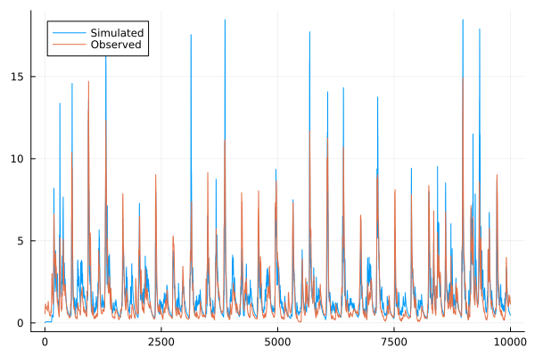

# ExpHydro Model Tutorial

## Overview

This tutorial demonstrates how to use the ExpHydro model for hydrological calculations, including:

- Lumped calculation (Single HRU)
- Distributed calculation (Multiple HRUs)

## Dependencies

First, import the required Julia packages:

```julia
using CSV            
using DataFrames     
using ComponentArrays
using BenchmarkTools
using NamedTupleTools
using Plots
```

## Model Setup

### Parameter Configuration

The ExpHydro model contains 6 key parameters defined using ComponentVector:

```julia
# Define model parameters
params = ComponentVector(
    f = 0.01674478,    # Infiltration parameter
    Smax = 1709.461015, # Maximum soil water storage
    Qmax = 18.46996175, # Maximum discharge
    Df = 2.674548848,   # Degree-day factor
    Tmax = 0.175739196, # Maximum temperature threshold
    Tmin = -2.092959084 # Minimum temperature threshold
)
```

### Initial States

Set initial states for the two calculation modules:

```julia
# Define initial states
inistates = ComponentVector(
    snowpack = 0.0,           # Snow accumulation
    soilwater = 1303.004248   # Soil water content
)
```

## Data Preparation

The model uses hydrometeorological data from "data/exphydro/01013500.csv":

```julia
# Read input data
file_path = "data/exphydro/01013500.csv"
data = CSV.File(file_path)
df = DataFrame(data)
ts = collect(1:10000)  # Time series length
```

Input variables include:

- Day length (dayl)
- Mean temperature (tmean)
- Precipitation (prcp)

## Import the ExpHydro Model

```julia
include("../models/ExpHydro.jl")
println(exphydro_model)
```

```txt
HydroModel: exphydro
  Components: surface, soil
  Inputs: temp, lday, prcp
  Outputs: pet, snowfall, rainfall, melt, evap, baseflow, surfaceflow, flow
  Parameters: Tmin, Tmax, Df, Smax, Qmax, f
  States: snowpack, soilwater
  Components:
    Fluxes: 0 fluxes
    Buckets: 2 buckets
    Route: nothing
```

## Model Testing

### Single Node Testing

```julia
# Configure solver
solver = HydroModels.ManualSolver{true}()
pas = ComponentVector(params=params, inistates=inistates)
# Run model with benchmarking
result = exphydro_model(input, pas, config=(solver=solver, timeidx=ts))

# convert to NamedTuple
model_total_output_names = vcat(HydroModels.get_state_names(exphydro_model), HydroModels.get_output_names(exphydro_model))
result_ntp = NamedTuple{Tuple(model_total_output_names)}(eachslice(result, dims=1))

# Visualize results
plot(result_ntp.flow, label="Simulated")
plot!(df[ts, "flow(mm)"], label="Observed")
```



### The other hydrological fluxes are also available

```julia
output_df = DataFrame(result)
```

```txt
10000×10 DataFrame
   Row │ snowpack  soilwater  pet       snowfall  rainfall  melt       evap     baseflow  surfaceflow  flow      
       │ Float64   Float64    Float64   Float64   Float64   Float64    Float64  Float64   Float64      Float64
───────┼─────────────────────────────────────────────────────────────────────────────────────────────────────────
     1 │      0.0      0.0    1.13779       0.0       3.1   0.0204477      0.0   1303.0      0.867263  0.0204477
     2 │      0.0      0.0    1.51019       0.0       4.24  0.0211591      0.0   1305.05     1.15292   0.0211591
     3 │      0.0      0.0    1.63204       0.0       8.02  0.0228657      0.0   1309.68     1.25036   0.0228657
     4 │      0.0      0.0    1.21771       0.0      15.27  0.0274505      0.0   1320.59     0.940706  0.0274505
     5 │      0.0      0.0    1.02779       0.0       8.48  0.033228       0.0   1332.0      0.800846  0.033228
   ⋮   │    ⋮          ⋮         ⋮         ⋮         ⋮          ⋮         ⋮        ⋮           ⋮           ⋮
  9996 │      0.0    261.111  0.221762      0.0       0.0   0.495441      -0.0   1493.37     0.193729  0.495441
  9997 │      0.0    266.638  0.238907     12.06      0.0   0.49106       -0.0   1492.84     0.208632  0.49106
  9998 │      0.0    278.143  0.288362     11.55      0.0   0.486664      -0.0   1492.3      0.25173   0.486664
  9999 │      0.0    285.026  0.311022      1.84      0.0   0.482119      -0.0   1491.74     0.271409  0.482119
 10000 │      0.0    286.074  0.176836      0.14      0.0   0.477275      -0.0   1491.14     0.154251  0.477275
```

### trial another solver (using [HydroModelTools](https://github.com/chooron/HydroModelTools.jl))

```julia
using HydroModelTools: ODESolver, DiscreteSolver
using OrdinalDiffEq

# using continuous solver
result1 = exphydro_model(input, pas, config=(solver=ODESolver(alg=Tsit5(), abstol=1e-3, reltol=1e-3), timeidx=ts))
# using discrete solver
result2 = exphydro_model(input, pas, config=(solver=DiscreteSolver(), timeidx=ts))
```

### Single Node Benchmarking

```julia
# Performance testing using BenchmarkTools
@btime exphydro_model(input, params, config=(solver=solver, timeidx=ts), convert_to_ntp=true);
@btime exphydro_model(input, params, config=(solver=ODESolver(alg=Tsit5(), abstol=1e-3, reltol=1e-3), timeidx=ts), convert_to_ntp=true);
@btime exphydro_model(input, params, config=(solver=DiscreteSolver(), timeidx=ts), convert_to_ntp=true);
```

Efficiency of each solver

```txt
16.612 ms (328670 allocations: 35.08 MiB)
16.748 ms (328670 allocations: 35.08 MiB)
7.844 ms (160412 allocations: 20.11 MiB)
```

### Multi-Node Testing

Multi-node setup for distributed computing:

```julia
# Setup multiple nodes
node_num = 10  # Number of nodes
inputs = repeat(reshape(input, size(input)[1], 1, size(input)[2]), 1, node_num, 1)
ptypes = [Symbol(:node, i) for i in 1:node_num]

# Configure parameters and states for multiple nodes
params_multi = ComponentVector(NamedTuple{Tuple(ptypes)}(repeat([params], node_num)))
init_states_multi = ComponentVector(NamedTuple{Tuple(ptypes)}(repeat([inistates], node_num)))
pas_multi = ComponentVector(params=params_multi, initstates=init_states_multi)
# Run multi-node simulation
results = exphydro_model(inputs, pas_multi, config=(solver=solver, timeidx=ts))
```

### Multi-Node Benchmarking

```julia
# Multi-node performance testing
@btime exphydro_model(inputs, pas_multi, config=(solver=solver, timeidx=ts));